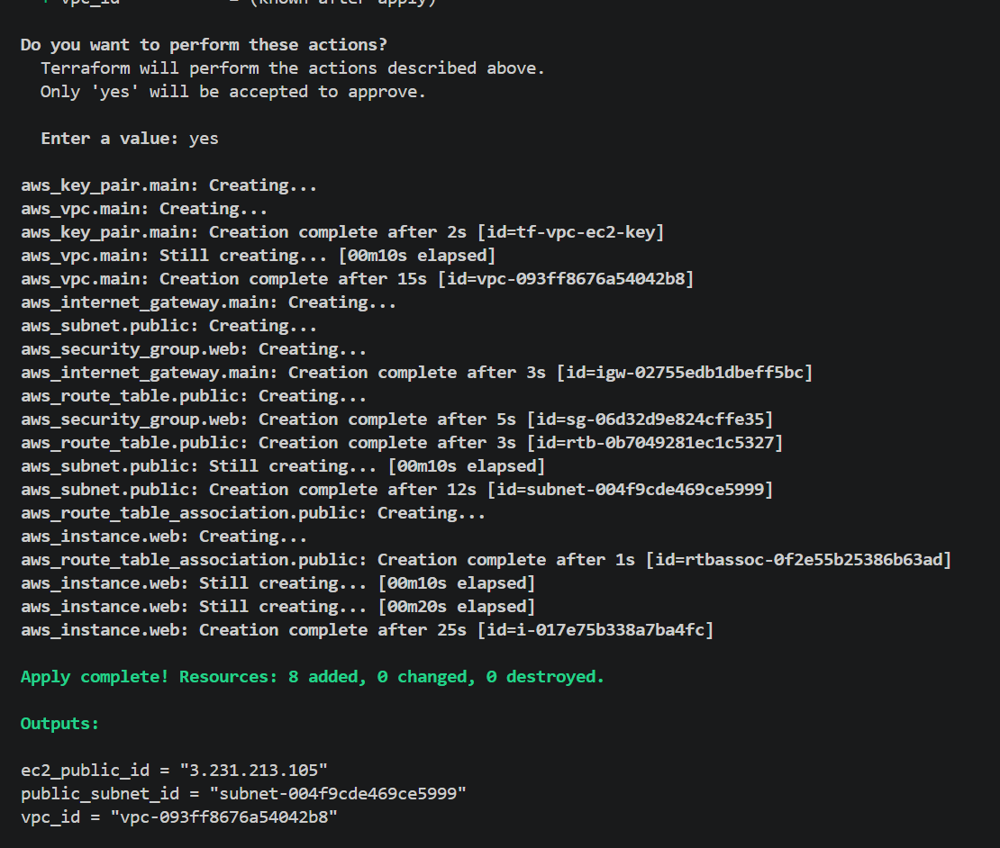
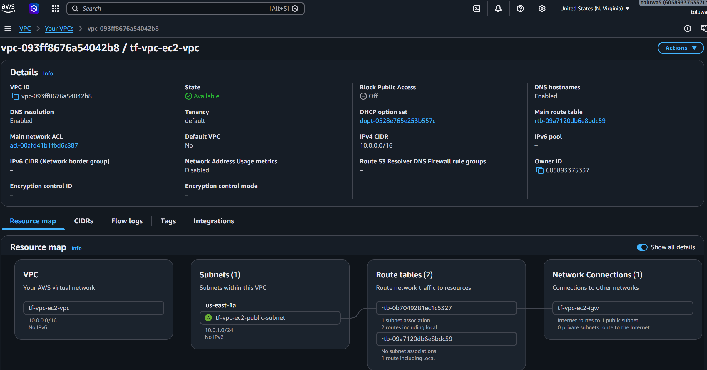
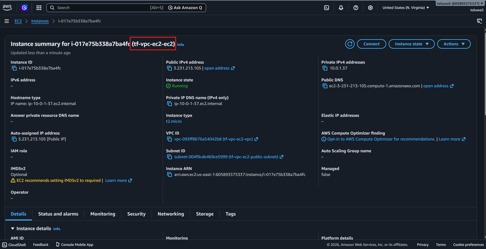
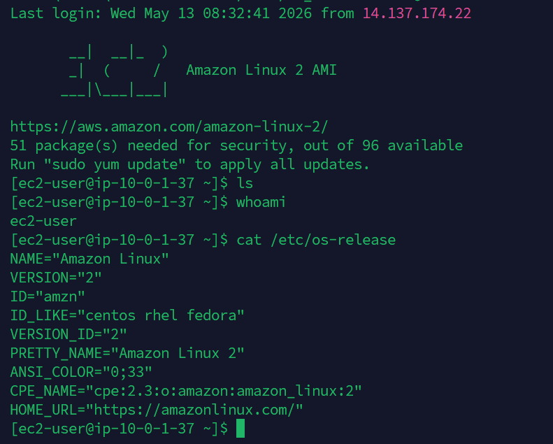

# AWS Terraform VPC + EC2 Setup

Provisioning a complete AWS networking stack and EC2 instance using Terraform. Infrastructure is defined as code, version controlled, and repeatable.

## Architecture

- VPC (10.0.0.0/16)
- Public Subnet (10.0.1.0/24)
- Internet Gateway
- Public Route Table
- Security Group (SSH + HTTP)
- EC2 Instance (Amazon Linux 2, t2.micro)
- SSH Key Pair

## Screenshots


<p><em>Terraform applying all 8 resources</em></p>


<p><em>VPC, subnet and internet gateway in AWS</em></p>


<p><em>EC2 instance running</em></p>


<p><em>SSH session into the EC2</em></p>

## Prerequisites

- Terraform installed
- AWS CLI installed and configured
- AWS IAM user with AdministratorAccess
- SSH key pair generated (~/.ssh/id_rsa)

## Usage

```bash
terraform init
terraform plan
terraform apply
```

To SSH into the EC2 instance:
```bash
ssh -i ~/.ssh/id_rsa ec2-user@<ec2_public_ip>
```

To destroy all resources:
```bash
terraform destroy
```

## Outputs

- VPC ID
- Public Subnet ID
- EC2 Public IP

## Tech Stack

Terraform - AWS VPC - EC2 - Security Groups